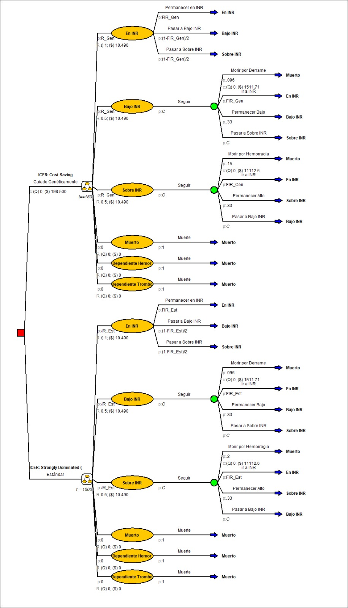

## Resumen de la Investigación

En este estudio se evalúa el **costo-efectividad** de implementar terapias farmacogenéticas en comparación con los esquemas terapéuticos tradicionales en el sistema de salud chileno. 

La farmacogenética permite personalizar la dosificación y elección de medicamentos —específicamente anticoagulantes como el **acenocumarol**— según el perfil genético individual de cada paciente, maximizando la eficacia clínica y disminuyendo dramáticamente episodios hemorrágicos o tromboembólicos adversos.

::: {.callout-note icon=true}
### 📄 Publicación Científica Internacional
Esta investigación forma parte del artículo científico:  
**"Cost-effectiveness of genotype-guided acenocoumarol therapy in atrial fibrillation: a pharmacogenomic simulation study in the chilean population"** (2026).  
[Acceder a la publicación (DOI: 10.1038/s41397-026-00411-7)](https://doi.org/10.1038/s41397-026-00411-7){target="_blank" .btn .btn-outline-primary .btn-sm .mt-2}
:::

{.project-image fig-align="center"}

---

## Objetivos del Estudio

1. **Modelar la Progresión Clínica:** Simular la evolución a lo largo del tiempo de pacientes con fibrilación auricular bajo esquemas de dosificación estándar versus guiados por genotipo.
2. **Evaluación Económica en Salud:** Estimar la Razón de Costo-Efectividad Incremental (ICER) considerando costos directos de secuenciación genética, hospitalizaciones, tratamientos y años de vida ajustados por calidad (QALYs).
3. **Soporte a Políticas Públicas:** Proveer evidencia cuantitativa rigurosa a tomadores de decisión sobre la rentabilidad de incorporar pruebas farmacogenéticas en las canastas de salud pública.

---

## Metodología

- **Modelos de Decisión de Markov:** Se definieron estados de salud mutuamente excluyentes (mantenimiento en rango terapéutico, eventos de sangrado menor/mayor, ACV isquémico y muerte).
- **Simulación y Software:** Se utilizó software especializado en evaluación económica en salud (**Amua**) complementado con análisis estadísticos para evaluar matrices de transición probabilísticas y análisis de sensibilidad determinísticos y probabilísticos (Monte Carlo).

---

## Impacto y Conclusiones

Los resultados demuestran que la inversión inicial en genotipificación se amortiza rápidamente gracias a la reducción sustancial de complicaciones graves y rehospitalizaciones, sustentando la viabilidad económica de la medicina de precisión en el contexto latinoamericano.
