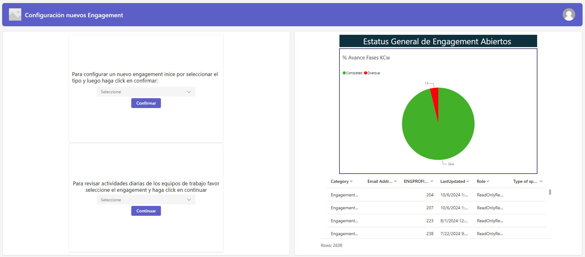
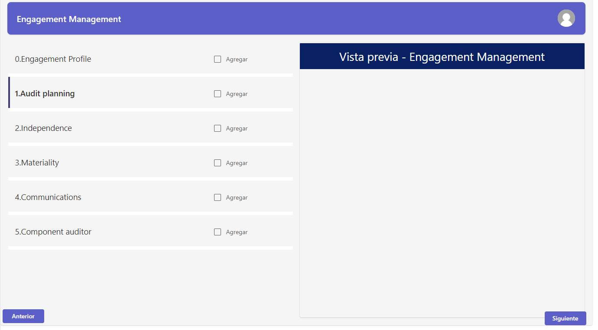

## Resumen del Proyecto

Esta aplicación desarrollada en **Microsoft PowerApps** tiene como objetivo central optimizar la administración y el flujo de trabajo de equipos operativos y de auditoría, facilitando el seguimiento transparente de tareas, disponibilidad horaria y comunicación interna. 

La solución brinda visibilidad en tiempo real a los líderes de equipo sobre la carga laboral de cada integrante, permitiendo tomar decisiones proactivas basadas en datos para balancear responsabilidades y evitar sobrecargas o cuellos de botella.

{.project-image fig-align="center"}

---

## Funcionalidades Principales

### 1. Asignación y Seguimiento Diario de Actividades
Permite parametrizar tareas con descripciones claras, plazos límites, criticidad y responsables asignados. Los colaboradores actualizan el avance en estados dinámicos (*Pendiente*, *En Progreso*, *Bloqueada*, *Completada*), manteniendo alineado a todo el equipo.

### 2. Tablero de Control en Tiempo Real
Un dashboard integrado resume los KPIs operativos clave:
- Horas hombre invertidas vs. estimadas.
- Porcentaje de cumplimiento de plazos contractuales.
- Identificación temprana de retrasos operativos.

### 3. Flujos de Automatización con Power Automate
El sistema genera alertas y recordatorios automáticos por correo o Teams ante vencimientos próximos o cambios de prioridad, reduciendo la necesidad de microgestión manual.

### 4. Gestión de Recursos y Capacidad (Staffing)
Los supervisores acceden a un mapa de disponibilidad que previene la sobreasignación de colaboradores y facilita una distribución equitativa de los nuevos requerimientos.

{.project-image fig-align="center"}

---

## Ecosistema Tecnológico

- **Frontend:** Microsoft PowerApps (Canvas App)
- **Automatización:** Microsoft Power Automate
- **Capa de Almacenamiento:** SharePoint Lists / Microsoft Dataverse
- **Colaboración:** Microsoft Teams & Outlook
