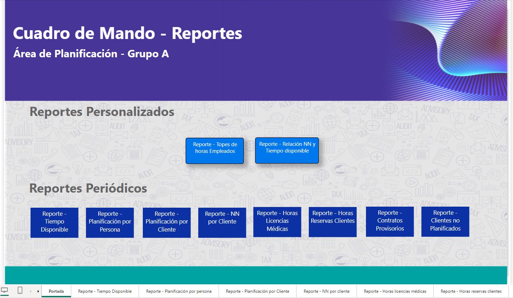
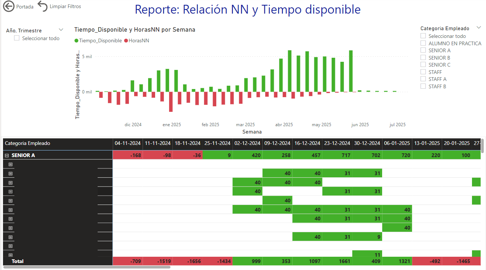

## Resumen del Proyecto

Este desarrollo en **Microsoft Power BI** provee una suite analítica diseñada para transformar la gestión estratégica de recursos humanos y planificación operativa. Mediante modelado avanzado de datos (DAX y Power Query) y visualizaciones dinámicas, los líderes de área obtienen visibilidad 360° sobre la utilización de personal, horas facturables, licencias y proyecciones de demanda.

{.project-image fig-align="center"}

---

## Objetivos del Proyecto

- **Visibilidad Ejecutiva:** Centralizar información dispersa de planillas, ERP y herramientas de tareas en un único punto de verdad analítico.
- **Detección Preventiva de Sobrecarga:** Identificar colaboradores en riesgo de burnout o subutilización mediante métricas de tasa de ocupación histórica y proyectada.
- **Optimización Presupuestaria:** Contrastar en tiempo real el gasto real de horas vs. el presupuesto asignado por proyecto.

---

## Características Principales

### 1. Dashboard de Disponibilidad y Rendimiento
Vista interactiva que desglosa la capacidad disponible por equipo, rango de fechas y proyectos activos. Permite drill-down por área, supervisor y colaborador.

### 2. Gestión de Ausentismo y Planificación de Vacaciones
Monitoreo continuo de licencias médicas, días compensatorios y vacaciones planificadas, integrando reglas de negocio para calcular el impacto directo en la capacidad productiva mensual.

### 3. Analítica Predictiva y Proyección de Demanda
Aprovechando datos históricos de demanda y estacionalidad, el reporte genera escenarios proyectados para anticipar contrataciones temporales o reasignación entre líneas de servicio.

{.project-image fig-align="center"}

---

## Tecnologías y Metodología

- **Plataforma:** Power BI Service & Power BI Desktop
- **Modelado:** DAX avanzado, Power Query (M), Modelo Estrella
- **Fuentes de Datos:** SQL Server, Microsoft Planner, Excel/SharePoint
- **Gobernanza:** Roles de seguridad a nivel de fila (RLS) y actualización programada
