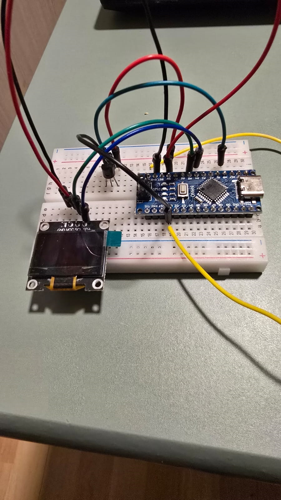

## Resumen del Proyecto

Este espacio recopila prototipos y proyectos de exploración en el ámbito de **sistemas embebidos, robótica y electrónica con Arduino**. La experimentación con microcontroladores ha permitido profundizar en la interacción directa entre software y hardware, adquisición de señales analógicas/digitales y protocolos de comunicación (I2C, SPI, UART).

{.project-image fig-align="center"}

---

## Prototipos Desarrollados

1. **Estación de Monitoreo de Temperatura:**
   - Adquisición de señales térmicas mediante sensor analógico LM35 con conversión de voltaje a grados Celsius.
   - Renderizado gráfico y numérico en tiempo real en una pantalla OLED monocromática (128x64) vía bus I2C.

2. **Controlador Bidireccional de Motores DC:**
   - Regulación de velocidad mediante modulación por ancho de pulsos (PWM) e inversión de giro utilizando puentes H (L298N).

3. **Mecanismo Servocontrolado con Señalización Visual:**
   - Control angular de alta precisión de servomotores acoplados a señalización LED con temporizadores no bloqueantes (`millis()`).

4. **Sistema de Detección de Presencia e Intrusión:**
   - Detección de proximidad mediante sensores infrarrojos pasivos (PIR) activando respuestas lumínicas y auditivas.

---

## Código Fuente: Adquisición y Visualización OLED

Ejemplo de implementación en C++ para lectura analógica con referencia interna estable y renderizado sobre librería Adafruit GFX / SSD1306:

```cpp
#define __DEBUG__

#include <SPI.h>
#include <Wire.h>
#include <Adafruit_GFX.h>
#include <Adafruit_SSD1306.h>

// Definiciones de hardware
#define ANCHO_PANTALLA 128
#define ALTO_PANTALLA  64
#define OLED_RESET     -1
#define DIRECCION_I2C  0x3C

Adafruit_SSD1306 display(ANCHO_PANTALLA, ALTO_PANTALLA, &Wire, OLED_RESET);

const int pinLM35 = A0;
float tempC = 0.0;

void setup() {
  Serial.begin(9600);
  
  // Referencia interna de 1.1V para mayor resolución en el ADC
  #if defined(__AVR_ATmega328P__)
  analogReference(INTERNAL);
  #endif

  if (!display.begin(SSD1306_SWITCHCAPVCC, DIRECCION_I2C)) {
    Serial.println(F("Fallo al inicializar pantalla OLED"));
    for(;;);
  }

  display.clearDisplay();
  display.setTextColor(SSD1306_WHITE);
  display.setTextSize(1);
  display.setCursor(0, 0);
  display.println(F("Inicializando..."));
  display.display();
  delay(1000);
}

void loop() {
  int lectura = analogRead(pinLM35);
  // Cálculo de temperatura según referencia de 1.1V (10mV por °C)
  tempC = (lectura * 110.0) / 1024.0;

  display.clearDisplay();
  display.setTextSize(1);
  display.setCursor(0, 5);
  display.println(F("ESTACION TERMICA"));
  display.drawLine(0, 16, 128, 16, SSD1306_WHITE);

  display.setTextSize(2);
  display.setCursor(10, 30);
  display.print(tempC, 1);
  display.print((char)247); // Símbolo de grados
  display.print(F("C"));
  
  display.display();
  delay(1000);
}
```

---

## Tecnologías y Componentes

- **Microcontrolador:** Arduino Uno / Nano (ATmega328P)
- **Lenguaje:** C / C++ (Arduino Framework)
- **Displays & Sensores:** Pantalla OLED SSD1306 (I2C), Sensor de temperatura LM35, Sensor PIR, Servos SG90
- **Librerías:** `Adafruit_GFX`, `Adafruit_SSD1306`, `Wire`
