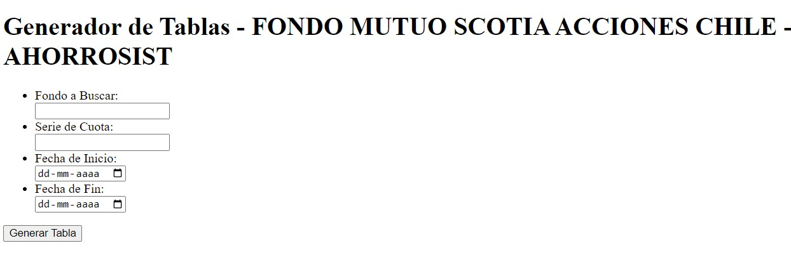
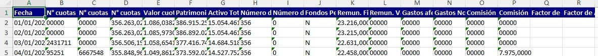

## Resumen del Proyecto

Este desarrollo utiliza **Python**, desplegado mediante el microframework **Flask**, para automatizar una prueba sustantiva de auditoría financiera centrada en la validación del **valor cuota de instrumentos financieros**. 

Tradicionalmente, esta prueba se ejecutaba de manera manual consultando la información en el portal público de la **Comisión para el Mercado Financiero (CMF)**, lo cual representaba un proceso repetitivo, extenso y propenso a errores de digitación. 

Con esta solución, se optimizó la extracción de información mediante un motor de scraping que consolida y estructura automáticamente los datos en un archivo Excel listo para papeles de trabajo.

{.project-image fig-align="center"}

---

## Objetivos del Proyecto

- **Eficiencia Operativa:** Reducir drásticamente las horas invertidas en la recolección manual de información para equipos de auditoría.
- **Mitigación de Riesgos:** Minimizar el margen de error humano en la transcripción de cifras críticas.
- **Estandarización:** Consolidar los resultados bajo un formato homogéneo y auditable que facilite la revisión por parte de supervisores y gerentes.

---

## Arquitectura y Características del Sistema

### 1. Motor de Web Scraping Personalizado
La herramienta se conecta de forma programática al portal de la CMF y extrae los registros de valores cuota, fechas y series correspondientes a los fondos mutuos e inversión auditados. La lógica permite parametrizar las consultas según la cartera específica y el período contable en revisión.

### 2. Interfaz Web Ligera con Flask
Para facilitar la adopción por parte de los auditores sin necesidad de ejecutar scripts en terminal, se implementó una interfaz amigable en Flask. Los auditores simplemente seleccionan los fondos, el rango temporal y ejecutan la validación en tiempo real.

### 3. Consolidación y Exportación a Excel
Una vez procesados y validados los datos, el sistema genera automáticamente un archivo estructurado en Excel (`.xlsx`) con fórmulas de control y formatos contables preestablecidos, listo para integrarse directamente al expediente de auditoría.

{.project-image fig-align="center"}

---

## Tecnologías Utilizadas

- **Lenguaje:** Python 3
- **Framework Web:** Flask (Jinja2, HTML5, CSS3)
- **Web Scraping:** Requests, BeautifulSoup
- **Procesamiento de Datos:** Pandas, OpenPyXL
- **Despliegue:** Entorno local / Red corporativa
